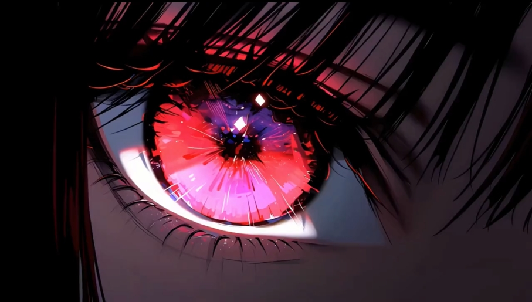

# MusicPlayer

基于 **Qt 6.11 (QML + C++)** 的本地音乐播放器，支持多种音频格式、歌词逐字同步、频谱可视化与粒子特效。



## 功能

- 🎵 **音频播放** — MP3 / FLAC / WAV / AAC / OGG / M4A / WMA 等常见格式
- 📝 **歌词同步** — LRC 歌词逐字高亮（卡拉 OK 风格）+ 发光特效 + 翻译显示
- 🎨 **2D 频谱可视化** — 圆角渐变柱状图，实时响应音乐频率
- ✨ **粒子背景** — 播放时浮动光点随音乐律动
- 💎 **毛玻璃 + 阴影** — 面板阴影、封面发光、按钮渐变，现代 UI 质感
- 📂 **媒体库管理** — 文件夹导入、分类管理、收藏、搜索、筛选、排序
- 🎛️ **播放队列** — 显示队列、点击切换、单曲移除 / 清空
- 🔀 **三种播放模式** — 顺序播放 / 单曲循环 / 随机播放
- 🖼️ **自定义背景图** — 支持任意图片作为背景 + 暗色叠加度调节
- 🎨 **主题色系统** — 8 种预设颜色 + 自定义取色器，全局联动
- 📌 **迷你播放器** — 置顶小窗口，显示封面、歌词和基本控制
- ⏱️ **睡眠定时器** — 15 / 30 / 45 / 60 / 90 分钟定时暂停
- 🔄 **跨曲淡入淡出** — 切换歌曲时平滑过渡
- 🖥️ **系统托盘** — 托盘图标 + 右键菜单（播放/暂停、上一首、下一首、退出）
- 💾 **状态记忆** — 重启后自动恢复上次播放进度、音量、主题色

## 技术栈

| 层 | 技术 | 作用 |
|---|---|---|
| UI | Qt Quick (QML) + Qt Quick Controls 2 | 界面布局、动画、交互 |
| 视觉效果 | Qt5Compat.GraphicalEffects + QtQuick.Particles | DropShadow / Glow / 粒子系统 |
| 音频 | Qt Multimedia (`QMediaPlayer` + `QAudioOutput`) | 播放、暂停、音量、进度 |
| 频谱分析 | `QAudioDecoder` + FFT 频域分析 | 2D 频谱数据生成 |
| 元数据 | `QMediaPlayer` 内置 + 文件名解析 | 读取歌曲标题 / 歌手 / 专辑 |
| 配置持久化 | `QSettings` | 保存播放状态、主题、音量等 |
| 构建 | CMake + MinGW | 跨平台构建 |

## 项目结构

```
MusicPlayer/
├── CMakeLists.txt               # CMake 构建配置（Qt6 + Core5Compat）
├── resources.qrc                # Qt 资源文件（QML + SVG 粒子素材）
├── particle.svg                 # 粒子特效素材
├── 111.png                      # 默认背景图片
├── README.md
│
├── src/                         # C++ 后端
│   ├── main.cpp                 # 程序入口 + 系统托盘
│   ├── app/
│   │   ├── AppModel.h/cpp       # 全局状态管理（QML 单例桥接）
│   │   └── Settings.h/cpp       # QSettings 持久化
│   ├── audio/
│   │   ├── AudioEngine.h/cpp    # QMediaPlayer 播放引擎封装
│   │   └── AudioAnalyzer.h/cpp  # 频谱分析（QAudioDecoder）
│   ├── library/
│   │   ├── LibraryManager.h/cpp # 音乐文件扫描、导入、管理
│   │   └── SongModel.h          # 歌曲数据结构
│   └── lyrics/
│       ├── LrcParser.h/cpp      # LRC 歌词解析
│       └── LyricsSync.h/cpp     # 歌词时间同步引擎
│
└── qml/                         # QML 前端
    ├── main.qml                 # 主窗口（布局总控 + 粒子系统）
    ├── TitleBar.qml             # 标题栏（视图切换 + 窗口控制）
    ├── ControlBar.qml           # 控制栏（进度条渐变 + 播放按钮发光）
    ├── LyricsPanel.qml          # 歌词面板（逐字高亮 + 发光 + 阴影）
    ├── Visualizer2D.qml         # 2D 圆角渐变频谱可视化
    ├── MiniPlayer.qml           # 迷你播放器（独立窗口）
    ├── MediaLibrary.qml         # 媒体库页面
    ├── LibrarySidebar.qml       # 分类侧栏
    ├── LibraryContent.qml       # 歌曲列表
    ├── PlaylistSidebar.qml      # 播放队列侧栏
    ├── SettingsPanel.qml        # 设置页面
    ├── Toast.qml                # 消息提示
    ├── ControlButton.qml        # 通用按钮组件
    ├── TimerButton.qml          # 睡眠定时器按钮
    ├── WindowButton.qml         # 窗口控制按钮
    ├── ViewTab.qml              # 视图标签按钮
    ├── SettingsGroup.qml        # 设置分组标题
    └── SettingRow.qml           # 设置行组件
```

## 构建 & 运行

### 前置要求

- **Qt 6.4+**（推荐 Qt 6.11，需要 `Core5Compat` 模块）
- **CMake 3.16+**
- **编译器**：MinGW 11+ 或 MSVC 2019+

### 安装 Qt

推荐使用 [Qt 在线安装器](https://www.qt.io/download-qt-installer)，勾选以下组件：

```
Qt 6.11.1
├── MinGW 13.1.0 64-bit
├── Additional Libraries
│   ├── Qt 5 Compatibility Module (Core5Compat)   ← 必须（发光/阴影/模糊）
│   ├── Qt Multimedia                              ← 必须（音频播放）
│   ├── Qt Quick 3D                               ← 可选（3D 可视化）
│   └── Qt Quick Particles                        ← QML 运行时自带
└── Developer and Designer Tools
    └── CMake
```

### 构建步骤

```powershell
# 克隆项目
git clone https://github.com/your-username/MusicPlayer.git
cd MusicPlayer

# 创建构建目录
mkdir build && cd build

# CMake 配置（路径换成你的 Qt 安装位置）
cmake .. -G "MinGW Makefiles" -DCMAKE_PREFIX_PATH="C:/A_ToolBox/qt/6.11.1/mingw_64"

# 编译
cmake --build . --config Release

# 运行
./MusicPlayer.exe
```

> 如果用 **Qt Creator** 打开项目，直接选择 `Desktop Qt 6.11.1 MinGW 64-bit` 套件，点击运行即可。

## 使用说明

1. **导入音乐** — 切换到"媒体库" → 点击"📁 导入" → 选择文件夹或文件
2. **播放** — 在歌曲列表中单击，或双击直接播放
3. **歌词** — 自动加载同目录下的 `.lrc` 文件，显示逐字高亮
4. **频谱** — 控制栏右侧切换 "2D / 关"，播放时实时显示
5. **粒子** — 播放时自动浮动光点背景（无需手动开启）
6. **迷你模式** — 点击 "⤡" 进入置顶小窗口
7. **睡眠定时** — 点击 "⏱" 设置定时暂停
8. **主题色** — 设置页面 → 点击预设颜色或取色器
9. **退出** — 右键托盘图标 → "退出"（关闭窗口仅最小化到托盘）

## 视觉效果亮点

| 效果 | 实现方式 | 位置 |
|------|---------|------|
| 歌词高亮字发光 | `Glow` (Qt5Compat.GraphicalEffects) | LyricsPanel.qml |
| 封面阴影 | `DropShadow` (Qt5Compat.GraphicalEffects) | LyricsPanel.qml / MiniPlayer.qml |
| 面板阴影 | `DropShadow` | LyricsPanel.qml |
| 播放按钮渐变 + 光晕 | `Gradient` + `DropShadow` | ControlBar.qml |
| 进度条渐变 + 发光拖拽球 | `Gradient` + `DropShadow` | ControlBar.qml |
| 频谱圆角渐变柱 | `Canvas` + `createLinearGradient` | Visualizer2D.qml |
| 浮动粒子背景 | `ParticleSystem` + `ImageParticle` | main.qml |
| 半透明标题栏 | `Qt.rgba()` 半透明背景 | TitleBar.qml |

## 注意事项

- 歌词文件（`.lrc`）需与音频文件**同名**并放在**同一目录**下
- 封面图支持：`cover.jpg` / `cover.png` / 歌曲同名 `.jpg` / `.png`
- 频谱分析在首次加载时需要解码（大文件可能需几秒）
- 退出程序请使用**托盘菜单"退出"**，关闭窗口仅最小化到托盘

## 许可证

MIT License
